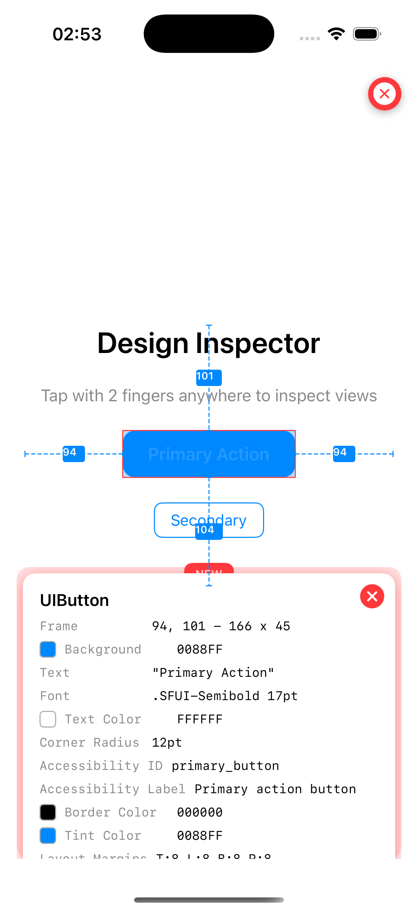
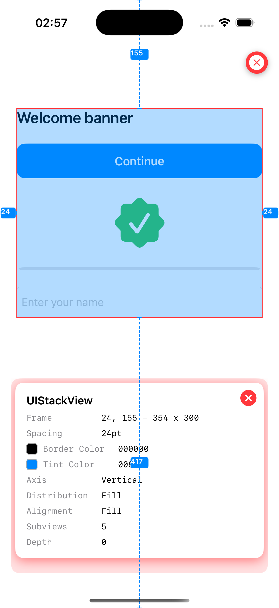
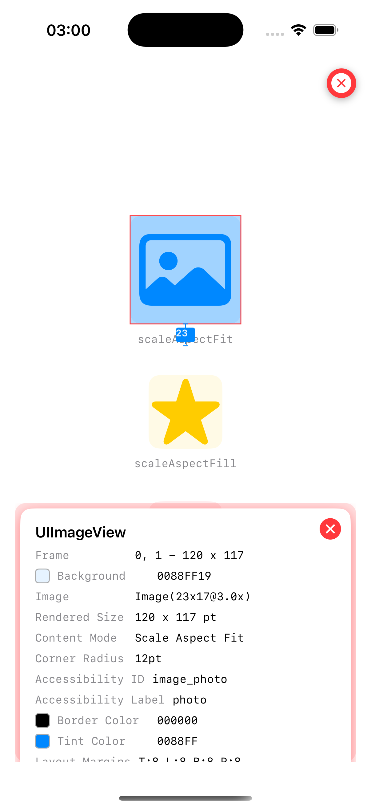
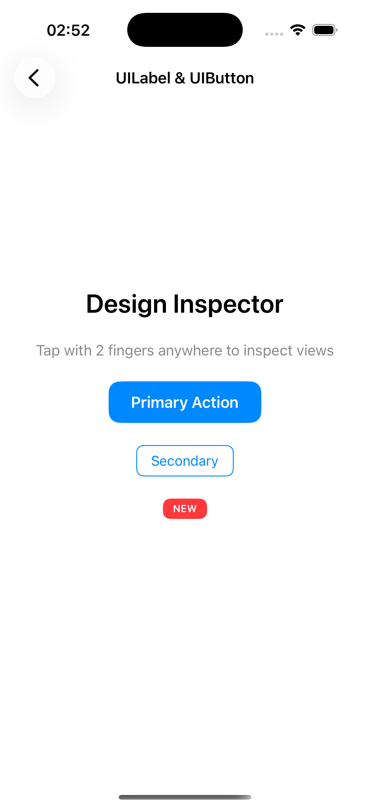
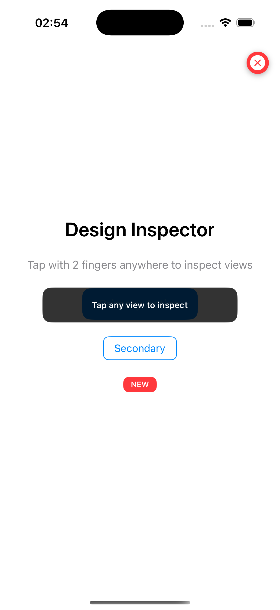
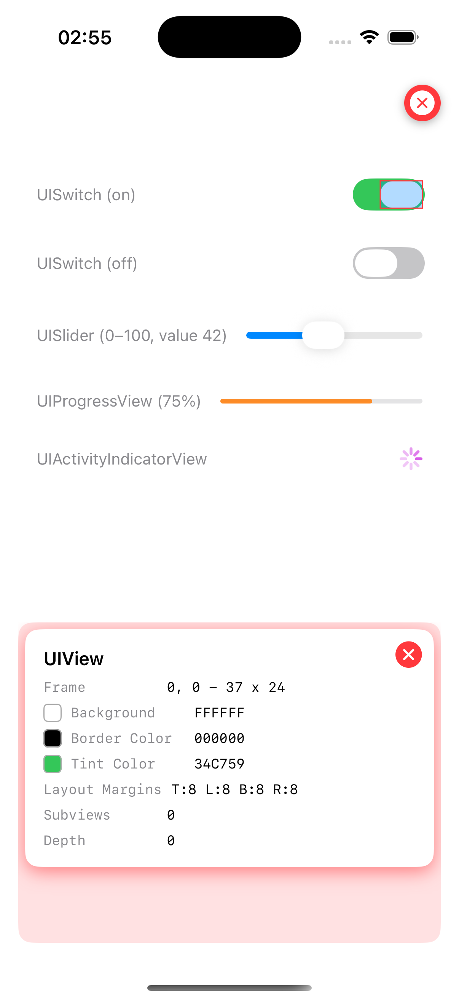
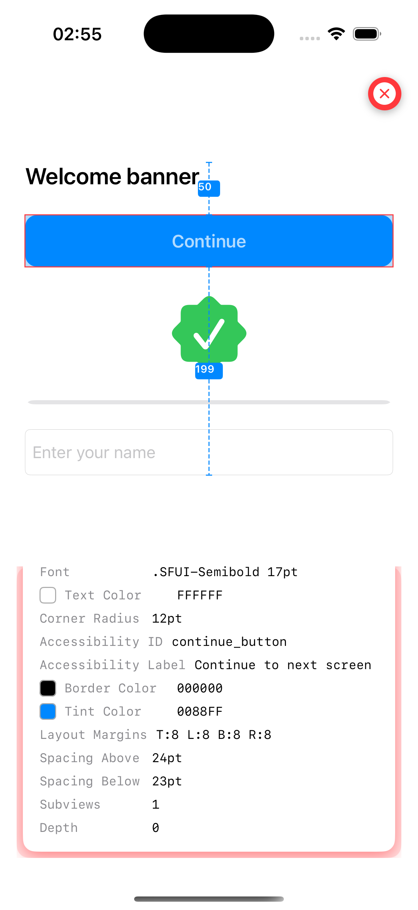

<div align="center">

# DesignInspectorKit

**A runtime UI inspection tool for iOS — tap any view to reveal its layout, colors, fonts, spacing, constraints and accessibility properties through a beautiful interactive overlay.**

<p>
  
  
  
  
  
</p>

<br/>

 &nbsp;&nbsp;
 &nbsp;&nbsp;


</div>

---

## Installation

### Swift Package Manager

Add to your `Package.swift`:

```swift
dependencies: [
    .package(url: "https://github.com/developer-jfm/DesignInspectorKit.git", from: "1.2.0")
]
```

Or via Xcode: **File → Add Package Dependencies...**

---

## Quick Start

```swift
import DesignInspectorKit

// Enable globally — auto-attaches to every view controller
DesignInspector.shared.enable()
```

Once enabled, **tap with 2 fingers** on any screen to activate the overlay, then **tap any view** to inspect it.

> 💡 **Simulator tip:** Hold **Option ⌥** while clicking to simulate a two-finger tap.

---

## Usage

### Manual attach to a specific view controller

```swift
viewController.enableDesignInspector()
```

### Present programmatically

```swift
DesignInspector.shared.inspect(viewController: self)
```

### Custom configuration

```swift
var config = InspectorConfiguration.default
config.highlightColor = UIColor.systemGreen.withAlphaComponent(0.3)
config.annotationColor = .systemBlue
config.colorTokenResolver = { color in DesignTokens.name(for: color) }
config.fontTokenResolver  = { font  in DesignTokens.name(for: font)  }
config.spacingTokenResolver = { spacing in DesignTokens.name(for: spacing) }
DesignInspector.shared.configuration = config
```

---

## Screenshots

<div align="center">

### Activation

<p>
  
  &nbsp;&nbsp;&nbsp;
  
</p>

*Left: normal app screen · Right: overlay active, waiting for a tap*

---

### Inspecting a View

<p>
  
  &nbsp;&nbsp;&nbsp;
  
</p>

*Left: selected view highlighted with spacing lines · Right: scrollable info panel with all properties*

---

### Spacing Annotations


*Dashed lines with numeric labels show exact distances from the selected view to its superview edges*

---

### Controls & Accessibility

<p>
  
  &nbsp;&nbsp;&nbsp;
  
</p>

*Left: UISwitch, UISlider, UIProgressView & UIActivityIndicatorView · Right: accessibilityLabel, identifier & traits*

</div>

---

## Inspected Properties

| Category | Properties |
|----------|-----------|
| **Layout** | Frame, Corner Radius, Border Width/Color, Alpha, Layout Margins |
| **Colors** | Background, Tint (with design token support) |
| **Text** | Content, Font, Text Color, Alignment, Number of Lines |
| **Image** | Name/token, Intrinsic size, Rendered size, Content mode |
| **UIStackView** | Axis, Distribution, Alignment, Spacing |
| **UIScrollView** | Content size, Content insets, Paging enabled |
| **UISwitch** | Is on, On tint color, Thumb tint color |
| **UISlider** | Current value, Min/Max range |
| **UIProgressView** | Progress %, Progress tint color |
| **UIActivityIndicatorView** | Is animating |
| **UISearchBar** | Placeholder, Text, Style, Cancel button, Bar tint color |
| **Accessibility** | Identifier, Label, Traits, Is accessibility element |
| **Sibling Spacing** | Distance to nearest sibling above, below, left, right |

---

## Visual Indicators

| Token | Default | Meaning |
|-------|---------|---------|
| `annotationColor` | 🔴 Red | Spacing lines, numeric labels, info panel accent |
| `highlightColor` | 🔵 Blue 30% | Semi-transparent fill over the selected view |
| `overlayBackgroundColor` | ⬛ Black 80% | Full-screen overlay background |
| `panelBackgroundColor` | System background | Info panel background |

All colors are fully customizable via `InspectorConfiguration`.

---

## Panel Interactions

| Interaction | Behaviour |
|-------------|-----------|
| **Tap a view** | Highlights the view and opens the info panel |
| **Tap the × button** | Closes the panel and clears highlights |
| **Swipe up the panel** | Dismisses the panel |
| **Tap close (top-right)** | Exits the inspector overlay |
| **Haptic feedback** | Light impact confirms every selection |

---

## Architecture

DesignInspectorKit follows **MVVM + Clean Architecture** with unidirectional data flow:

```
┌─────────────────────────────────────────────────────┐
│  View  —  InspectorOverlayViewController            │
│  • Observes InspectorViewModel.$state via Combine   │
│  • Zero business logic — renders state only         │
└────────────────────┬────────────────────────────────┘
                     │ user tap → onTap()
                     ▼
┌─────────────────────────────────────────────────────┐
│  ViewModel  —  InspectorViewModel                   │
│  • @Published InspectorState:                       │
│    .idle / .active / .selected(InspectorSelection)  │
│  • Delegates traversal & inspection to Repository   │
└────────────────────┬────────────────────────────────┘
                     │ findView / frame / inspect
                     ▼
┌─────────────────────────────────────────────────────┐
│  Repository  —  InspectorRepository (protocol)      │
│  • ViewInspectorRepository (concrete impl.)         │
│  • All UIKit traversal logic encapsulated here      │
│  • Fully mockable for unit tests                    │
└─────────────────────────────────────────────────────┘
```

---

## Project Structure

```
Sources/DesignInspectorKit/
├── DesignInspectorKit.swift          # Entry point — DesignInspector.shared
├── Domain/
│   ├── InspectorState.swift          # Enum: .idle / .active / .selected
│   └── InspectorRepository.swift     # Protocol — data layer contract
├── Presentation/
│   └── InspectorViewModel.swift      # @Published state, onTap(), Combine
├── Data/
│   └── ViewInspectorRepository.swift # UIKit traversal implementation
├── Core/
│   ├── DesignInspectorSwizzler.swift  # Method swizzling for auto-attach
│   └── ViewHierarchyInspector.swift   # View property extraction
├── Models/
│   ├── ViewInspectorInfo.swift        # Inspected view data snapshot
│   └── InspectorConfiguration.swift  # Appearance & token resolvers
├── Views/
│   ├── InspectorOverlayViewController.swift  # Full-screen overlay
│   └── InspectorInfoPanelView.swift          # Scrollable property panel
├── Extensions/
│   ├── UIView+Inspector.swift         # Spacing & deep hit-test helpers
│   ├── UIViewController+Inspector.swift
│   ├── UIColor+Hex.swift
│   └── String+Localization.swift      # InspectorKey typed strings
└── Resources/
    ├── en.lproj/Localizable.strings
    ├── pt-BR.lproj/Localizable.strings
    └── es.lproj/Localizable.strings

Tests/DesignInspectorKitTests/
└── DesignInspectorKitTests.swift      # 63 unit tests
```

---

## Example App

A fully working example is included:

```
Examples/DesignInspectorExample/DesignInspectorExample.xcodeproj
```

Includes dedicated screens for UILabel, UIButton, UIImageView, UIStackView, UIScrollView, controls, accessibility and UISearchBar.

See [`Examples/DesignInspectorExample/README.md`](Examples/DesignInspectorExample/README.md) for setup instructions.

---

## Localization

| Language | Code |
|----------|------|
| English | `en` |
| Portuguese (Brazil) | `pt-BR` |
| Spanish | `es` |

---

## Development

```bash
# Build
xcodebuild -scheme DesignInspectorKit -destination 'platform=iOS Simulator,name=iPhone 16'

# Test
xcodebuild test -scheme DesignInspectorKit -destination 'platform=iOS Simulator,name=iPhone 16'
```

---

## License

MIT License — see [LICENSE](LICENSE) for details.
